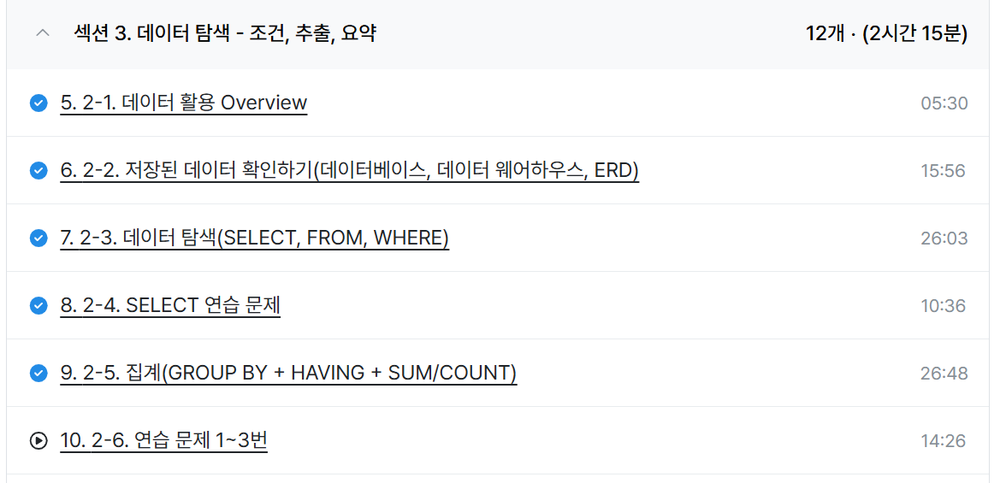

# SQL_BASIC 2주차 정규 과제 

📌SQL_BASIC 정규과제는 매주 정해진 분량의 `초보자를 위한 BigQuery(SQL) 입문` 강의를 듣고 간단한 문제를 풀면서 학습하는 것입니다. 이번주는 아래의 **SQL_Basic_2nd_TIL**에 나열된 분량을 수강하고 `학습 목표`에 맞게 공부하시면 됩니다.

**2주차 과제**는 1주차 과제처럼 SQL의 필요성이나 느낀점 위주가 아닌, **실제 강의 내용을 바탕으로 개념을 정리하고 학습한 내용을 집중적으로 기록**해주세요. 완성된 과제는 Github에 업로드하고, 링크를 스프레드시트 'SQL' 시트에 입력해 제출해주세요. 

**👀(수행 인증샷은 필수입니다.)** 

## SQL_BASIC_2nd

### 섹션 3. 데이터 탐색 - 조건, 추출, 요약

### 2-3. 데이터 탐색 (SELECT, FROM, WHERE)

### 2-4. SELECT 연습문제

### 2-5. 집계 (Group By + Having + Sum/Count)

## 🏁 강의 수강 (Study Schedule)

| 주차  | 공부 범위              | 완료 여부 |
| ----- | ---------------------- | --------- |
| 1주차 | 섹션 **1-1** ~ **2-2** | ✅         |
| 2주차 | 섹션 **2-3** ~ **2-5** | ✅         |
| 3주차 | 섹션 **2-6** ~ **3-3** | 🍽️         |
| 4주차 | 섹션 **3-4** ~ **4-4** | 🍽️         |
| 5주차 | 섹션 **4-4** ~ **4-9** | 🍽️         |
| 6주차 | 섹션 **5-1** ~ **5-7** | 🍽️         |
| 7주차 | 섹션 **6-1** ~ **6-6** | 🍽️         |

 

<!-- 여기까진 그대로 둬 주세요-->

---

# 1️⃣ 개념정리 

## 2-3. 데이터 탐색 (SELECT, FROM, WHERE)

~~~
✅ 학습 목표 :
* SQL 쿼리 구조를 이해할 수 있다. 
* SELECT, FROM, WHERE의 핵심 문법을 설명할 수 있다. 
~~~

1. SQL 쿼리 구조 이해 -> 집합으로 이해
데이터셋이 있고 내부에 여러개의 테이블이 있다.
그 테이블에서 우리가 원하는 데이터 부분만 쓰기 위해 SELECT, FROM, WHERE을 통해 데이터를 추출하여 사용하게 된다.

2. SELECT, FROM, WHERE의 핵심 문법 설명

| 구분 | 설명 |
|-----|-----|
| FROM | - Dataset.Table: 어떤 테이블에서 데이터를 확인할 것인지   - 이름이 너무 길면 `AS "별칭"`으로 지정 가능   - 예: `FROM Table1 AS t1` |
| WHERE | - FROM에 명시된 Table에 저장된 데이터를 필터링(조건 설정)   - Table에 있는 컬럼을 기준으로 조건 설정 |
| SELECT | - Table에 저장되어 있는 컬럼 선택   - 여러 컬럼 명시 가능   - `col1 AS "별칭"`으로 컬럼 이름에도 별칭 지정 가능 |

코드 예시
SELECT
    * #모든 컬럼을 출력하겠다.
FROM basic.pokemon (데이터셋.테이블)
WHERE
    type1="Fire"

SELECT
    * EXCEPT(제외할 컬럼) -> 컬럼 제외

## 2-5. 집계 (Group By / HAVING / SUM,COUNT)

~~~
✅ 학습 목표 :
* 데이터를 집계하고 그룹화하는 방법을 설명할 수 있다.
* GROUP BY, HAVING, ORDER BY, 집계함수(SUM/COUNT 등)을 활용하는 방법을 설명할 수 있다.
* having과 where의 차이에 대해서 설명할 수 있다.
~~~

1. 데이터를 집계하고 그룹화하는 방법 설명
 -> 모아서(그룹화해서) 계산하다(평균, 합, 차, 최대, 최소, 개수 등)

2. GROUP BY, HAVING, ORDER BY, 집계함수(SUM/COUNT 등)을 활용하는 방법을 설명할 수 있다.

- GROUP BY: 같은 값끼리 모아서 그룹화한다.
ex) 포켓몬에서 타입별로 평균 공격력 확인하기

- ORDER BY: 정렬
ex) 그룹화한 데이터에서 평균 공격력을 오름차순으로 정렬하기
    - 쿼리의 맨 마지막에만 작성하면 됨
    - DESC(내림차순), OSC(오름차순)

- HAVING: 집계 후에 조건 설정
ex) 집계된 데이터에서 포켓몬 수가 10 이상인 것만 추출하기

코드 문법
SELECT
    집계할_컬럼1,
    집계함수(COUNT, MAX, MIN 등)
FROM Table
GROUP BY
    집계할_컬럼1

3. having과 where의 차이에 대해서 설명할 수 있다.
- WHERE: Table에 바로 조건을 설정하고 싶은 경우 사용
    - Raw Data인 테이블 데이터에서 조건 설정
- HAVING: GROUP BY한 후 조건을 설정하고 싶은 경우 사용

HAVING 문법

SELECT
    컬럼1, 컬림2,
    COUNT(컬럼1) AS col1_count
FROM <table>
GROUP BY 컬럼1, 컬럼2
HAVING                     #GROUP BY가 된 상태에서 조건을 검
    col1_count > 3

예제문제 코드
-- SELECT
--   COUNT(id) AS cnt,
--   COUNT(*) AS cnt2
-- FROM basic.pokemon

-- SELECT
--   generation,
--   COUNT(id) AS cnt
-- FROM basic.pokemon
-- GROUP BY
--   generation

SELECT
  type1,
  COUNT(id) AS cnt
FROM basic.pokemon
GROUP BY
  type1
HAVING cnt >= 10
ORDER BY cnt DESC

# 2️⃣ 학습 인증란

  

---

# 3️⃣ 확인문제

## 문제 1

> **🧚Q. 포켓몬 마스터 진아는 포켓몬 데이터 조회하는 SQL문에 재미를 느껴서 혼자서 데이터를 조회하는 쿼리문을 짰습니다. 하지만 세 가지의 오류로 다음 코드가 실행이 안된다고 하는데, 각 오류의 위치와 이유를 설명하고, 올바른 쿼리문으로 수정해보세요.**

~~~sql
# 진아의 SQL Query문 
SELECT name. type
FROM pokemon;
WHERE type = Electric;
~~~

~~~
1. SELECT에서 name과 type을 뽑아내고싶으면 ','를 써야하는데 '.'을 썼다.
2. FROM pokemon에서 데이터셋.테이블로 들어가야하므로 basic.pokemon이라고 바꿔야한다. 또한 ';'를 빼야한다.
3. WHERE type = Electric에서 Electric은 문자이므로 큰따옴표를 붙여 "Electric"라고 써야한다.

올바른 쿼리문
SELECT name, type
FROM basic.pokemon
WHERE type = "Electric";
~~~

## 문제 2

> **🧚Q. 앞서 SQL Query의 오류를 해결한 진아는 기분 좋게 이번에는 포켓몬 데이터에서 타입별 평균 공격력이 60 이상인 타입만 조회하려는 쿼리를 작성하려고 했습니다. 하지만 이번에도 실수를 하여 쿼리문이 실행되지 않거나 잘못된 결과가 나오고 있는데, 쿼리에서 잘못된 부분이 무엇인지 설명하고, 올바르게 수정한 쿼리를 작성해보세요.**

~~~sql
SELECT type, AVG(attack) AS avg_attack
FROM pokemon
WHERE AVG(attack) >= 60
GROUP BY type;
~~~

~~~
잘못된 부분: 데이터에서 타입별 평균 공격력이 60 이상인 타입만 조회하려는 
상황이므로 GROUP BY를 활용하여 타입별 평균 공격력을 계산한다.
이후 그룹화된 데이터에서 공격력이 60 이상인 조건을 활용하는 상황이므로
WHERE이 아닌 HAVING을 사용해야한다.

올바른 코드
SELECT type, AVG(attack) AS avg_attack
FROM pokemon
GROUP BY type;
HAVING AVG(attack) >= 60
~~~

### 🎉 수고하셨습니다.